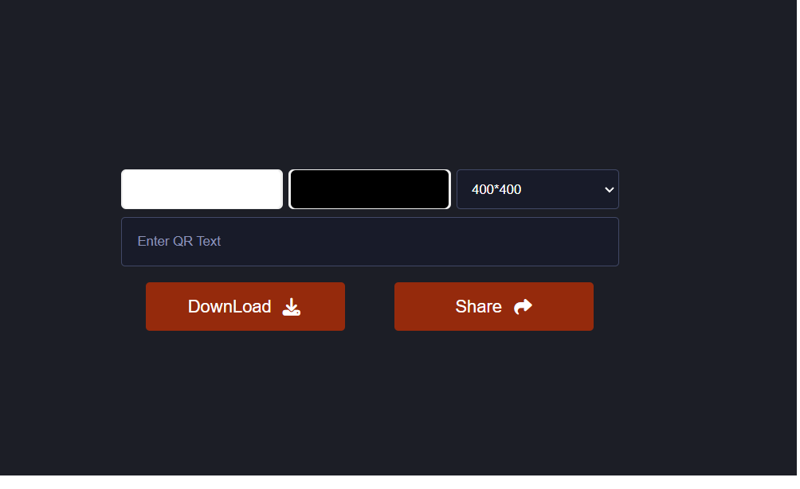

# QR Code Generator

[Demo](https://ummahanakcanqr-codegenerator.netlify.app/)

  ## Project Overview

- During the project process, I encountered the necessity to utilize the Async-await feature, prompting me to conduct comprehensive research on callback, promise, and async-await structures. You may refer to the following sources for further information.
  
  [Mastering Callbacks in JavaScript](https://medium.com/@PavanCodeCraft/mastering-callbacks-in-javascript-f25b75898554)
  
  [What is Promise](https://developer.mozilla.org/en-US/docs/Web/JavaScript/Reference/Global_Objects/Promise)

  [Mastering Async-Await in JavaScript](https://medium.com/@PavanCodeCraft/mastering-async-await-in-javascript-360d0a229359)

- In this project, the qrcode.js library has been utilized. This library can be used to dynamically generate QR codes in web-based applications, enabling users to interact by scanning these QR codes on their devices.

  You can import the qrcode.js library from the following link.

  [cdnjs](https://cdnjs.com/libraries/qrcode-generator)
